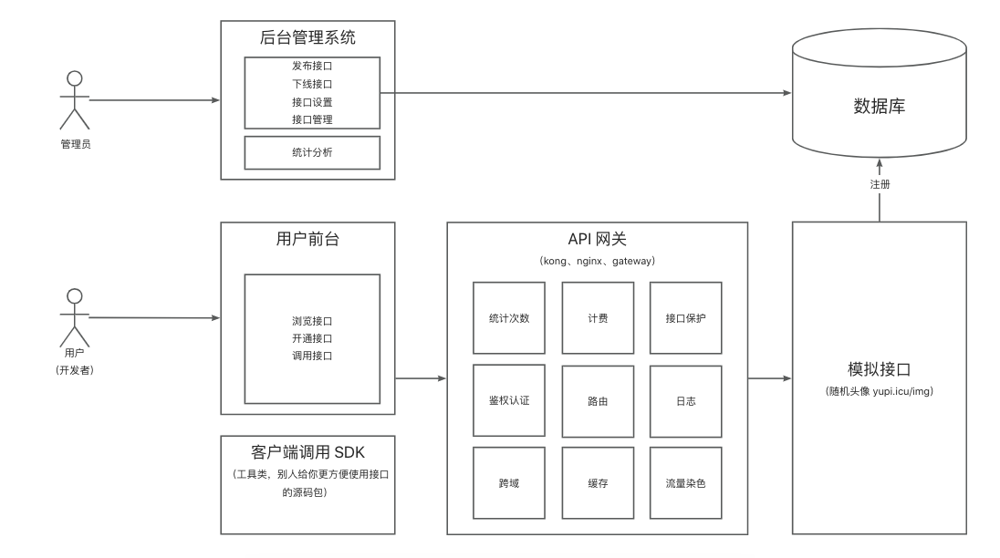

## Faiz API 🌈
> 一个丰富的 API 开放调用平台，提供了一些接口调用服务，方便大家使用。
> 基于 Spring Boot + Spring Cloud Alibaba + MP + Redis + MQ 的 API 接口开放调用平台。
> 
> 管理员可以接入并发布接口，可视化接口的调用情况。
> 
> 普通用户可以注册并登录，浏览接口，申请 ak/sk 去在线调用接口，也可以下载sdk调用接口。
> 
> 在线体验地址：http://api.tempeisite.xyz/
> 
> 管理员账号：faiz 密码：123456789
> 
> 普通用户账号：decade 密码：123456789
---
## 项目背景
Faiz API 平台初衷是尽可能地帮助和服务更多的用户和开发者， 为开发者提供API接口，提高开发者开发效率的平台。我们可以为用户提供各种类型的接口服务，使他们能够更高效地完成需求，例如：获取每日一言、毒鸡汤、qq头像等服务。
项目后端使用语言为Java，包括现在市面上主流技术栈，采用微服务架构开发，解耦业务模块，前端使用React，Ant Design Pro + Ant Design组件库，使用现成组件库快速开发项目。
项目前端地址：https://github.com/Tenpeisite/faiz-api-frontend

---
## 后端技术栈
- 框架：SpringBoot、Spring Cloud Alibaba、Mybatis-plus
- 数据库：Mysql、Redis
- 中间件：RabbitMQ、Canal、XXL-JOB
- 服务调用：Dubbo
- 注册中心：Nacos
---
## 项目目录
- API-backend：后端服务，提供接口、用户等基本操作
- API-common：通用模块，减少冗余代码
- API-gateway：api网关模块，作为接口调用的入口，包含路由转发、参数校验、流量染色......等功能
- API-interface：接口服务，向外提供接口服务
- API-client-sdk：提供给开发者使用的sdk
- sql：项目数据库所需的sql
- config：nacos中的配置
---
## 项目架构图

